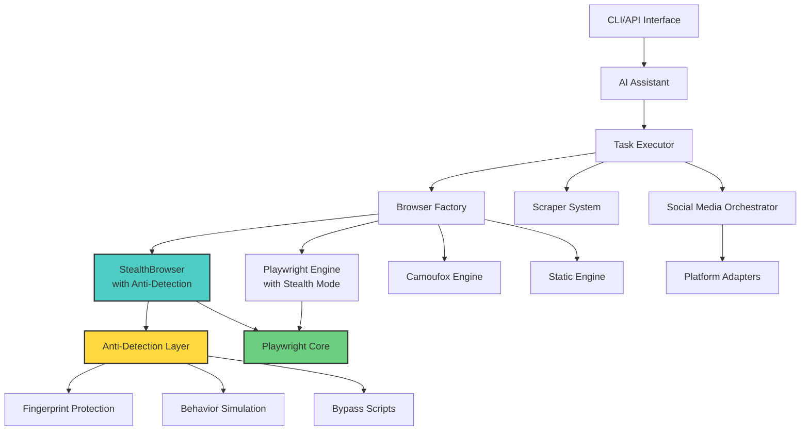

<div align="center">

<!-- Animated Typing SVG Header -->
<a href="https://github.com/chatcbdai/uoa">
  
</a>

<br/>
<br/>

<!-- Elite Badges -->
<p align="center">
  
  
  
  
  
  
</p>

<p align="center">
  
  
  
  
  
</p>

<!-- Animated Demo GIF -->
<br/>

<br/>
<br/>

<!-- Quick Navigation -->
<p align="center">
  <a href="#-features">Features</a> •
  <a href="#-installation">Installation</a> •
  <a href="#-quick-start">Quick Start</a> •
  <a href="#-documentation">Documentation</a> •
  <a href="#-examples">Examples</a> •
  <a href="#-api-reference">API</a> •
  <a href="#-contributing">Contributing</a>
</p>

</div>

---

<div align="center">
  <h3>🎯 The Ultimate Web Automation Toolkit That Can't Be Detected</h3>
  <p>
    <em>Bypass Cloudflare, reCAPTCHA, and any bot detection system while automating the web with AI</em>
  </p>
</div>

---

## 🌟 Why UOA?

<table>
<tr>
<td width="33%" align="center">
  
  <br/><br/>
  <b>🛡️ Truly Undetectable</b>
  <br/>
  <sub>Advanced fingerprinting protection and human-like behavior simulation</sub>
</td>
<td width="33%" align="center">
  
  <br/><br/>
  <b>🤖 AI-Powered Intelligence</b>
  <br/>
  <sub>Natural language commands with GPT-4 and Claude integration</sub>
</td>
<td width="33%" align="center">
  
  <br/><br/>
  <b>🚀 All-in-One Solution</b>
  <br/>
  <sub>Web scraping, automation, and social media in a single toolkit</sub>
</td>
</tr>
</table>

## ✨ Features

<details open>
<summary><b>🛡️ Anti-Detection Arsenal</b></summary>

- **Advanced Fingerprinting Protection**: Bypass even the most sophisticated detection systems
- **Human-like Behavior**: Natural typing, mouse movements, and interaction delays
- **Multiple Browser Engines**: StealthBrowser, Playwright, Camoufox, and Static modes
- **Dynamic Headers**: Rotating User-Agents, realistic viewport sizes, and browser profiles
- **JavaScript Bypass Scripts**: WebDriver detection, Chrome runtime, and plugin spoofing

</details>

<details>
<summary><b>🌐 Web Automation Superpowers</b></summary>

- **Intelligent Scraping**: Single page, pattern matching, full-site crawling
- **Smart Element Detection**: AI-powered dynamic element identification
- **Form Automation**: Complex multi-step forms with file uploads
- **Session Management**: Cookie persistence and authentication handling
- **Concurrent Processing**: Rate-limited parallel execution

</details>

<details>
<summary><b>📱 Social Media Automation</b></summary>

- **Multi-Platform Support**: Instagram, Twitter/X, Facebook, LinkedIn
- **Bulk Posting**: CSV-based content scheduling and management
- **Media Handling**: Image and video uploads with metadata
- **Security**: Encrypted credential storage with OS keyring integration
- **Smart Detection**: No hardcoded selectors - adapts to UI changes

</details>

<details>
<summary><b>🤖 AI Assistant Interface</b></summary>

- **Natural Language**: Plain English commands like "scrape all documentation from..."
- **Context Memory**: Maintains conversation history for complex tasks
- **Task Planning**: Automatic breakdown of complex operations
- **Error Recovery**: Intelligent retry logic and graceful degradation

</details>

## 🚀 Installation

### Prerequisites
- Python 3.8+
- Chrome/Chromium browser
- Node.js (for Playwright)

### Quick Install

```bash
# Clone the repository
git clone https://github.com/chatcbdai/uoa.git
cd uoa

# Install dependencies
pip install -r requirements.txt

# Install Playwright browsers
playwright install chromium

# Set up environment
cp .env.example .env
# Edit .env with your API keys
```

### 🐳 Docker Installation (Coming Soon)

```bash
docker pull chatcbdai/uoa:latest
docker run -it chatcbdai/uoa
```

## 💡 Quick Start

### 🎯 CLI Assistant Mode

```bash
python main.py
```

```
🤖 AI Web Assistant Ready!
> Search for Python web scraping tutorials and create a comparison table
> Take a screenshot of the Amazon homepage
> Post "Hello World" to Twitter with #automation
```

### 🐍 Python API

```python
from api import scrape, browse, post_to_social

# Scrape with stealth mode
content = await scrape("https://example.com", 
                      output="markdown",
                      headless=False)

# Browser automation
async with browse() as browser:
    await browser.navigate("https://github.com")
    await browser.fill_form({
        'input[name="q"]': "undetectable automation"
    })
    await browser.screenshot("search_results.png")

# Social media posting
results = await post_to_social(
    platforms=["twitter", "linkedin"],
    content={
        "text": "Check out UOA - The undetectable automation toolkit! 🚀",
        "image": "demo.png"
    }
)
```

## 📖 Documentation

<table>
<tr>
<td width="50%">

### 📚 Core Modules

- **Browser Engines** - StealthBrowser, Playwright, Camoufox
- **Anti-Detection** - Fingerprinting and bypass techniques
- **Scrapers** - Unified scraping interface
- **Social Media** - Platform automation
- **AI Assistant** - Natural language interface

</td>
<td width="50%">

### 🔧 Advanced Topics

- **Configuration** - Environment and settings
- **Authentication** - Credential management
- **Rate Limiting** - Request throttling
- **Error Handling** - Exception management
- **Best Practices** - Production tips

</td>
</tr>
</table>

## 🎯 Examples

### 🕷️ Web Scraping

<details>
<summary><b>Scrape Documentation Site</b></summary>

```python
# Scrape entire documentation with pattern matching
docs = await scrape(
    "https://docs.example.com",
    mode="pattern",
    pattern="/docs/*",
    max_depth=3,
    output="markdown"
)
```

</details>

<details>
<summary><b>E-commerce Price Monitoring</b></summary>

```python
# Monitor product prices across multiple sites
sites = ["amazon.com", "ebay.com", "walmart.com"]
results = []

async with browse(headless=True) as browser:
    for site in sites:
        await browser.navigate(f"https://{site}/product/123")
        price = await browser.extract('span.price')
        results.append({"site": site, "price": price})
```

</details>

### 🤖 Browser Automation

<details>
<summary><b>Complex Form Submission</b></summary>

```python
async with browse(anti_detection=True) as browser:
    # Navigate and login
    await browser.navigate("https://app.example.com")
    await browser.login(
        username="user@email.com",
        password="secure_password",
        username_selector="#email",
        password_selector="#password",
        submit_selector="button[type='submit']"
    )
    
    # Fill complex form
    await browser.fill_form({
        'input[name="title"]': "Project Name",
        'textarea[name="description"]': "Long description...",
        'select[name="category"]': "technology",
        'input[type="file"]': "/path/to/document.pdf"
    })
```

</details>

### 📱 Social Media Automation

<details>
<summary><b>Multi-Platform Posting</b></summary>

```python
# Schedule posts from CSV
content_manager = ContentManager("./social_content")
orchestrator = SocialMediaOrchestrator(storage_path, llm_client)

# Add credentials securely
orchestrator.add_credentials("instagram", "username", "password")
orchestrator.add_credentials("twitter", "username", "password")

# Post to multiple platforms
results = await orchestrator.post_to_platforms(
    platforms=["instagram", "twitter"],
    use_csv=True  # Uses scheduled_posts.csv
)
```

</details>

## 🏗️ Architecture



## 🔌 API Reference

### Core Functions

| Function | Description | Parameters |
|----------|-------------|------------|
| `scrape()` | Scrape web content | `url`, `mode`, `output`, `options` |
| `browse()` | Browser automation context | `engine`, `headless`, `anti_detection` |
| `post_to_social()` | Social media posting | `platforms`, `content`, `options` |
| `monitor()` | Website monitoring | `url`, `interval`, `callback` |

### Browser Methods

| Method | Description | Example |
|--------|-------------|---------|
| `navigate()` | Go to URL | `await browser.navigate("https://example.com")` |
| `click()` | Click element | `await browser.click("button.submit")` |
| `fill_form()` | Fill form fields | `await browser.fill_form({"#name": "John"})` |
| `extract()` | Extract content | `data = await browser.extract("table.results")` |
| `screenshot()` | Take screenshot | `await browser.screenshot("page.png")` |

## 🛡️ Security

- **Credential Encryption**: Fernet encryption with OS keyring integration
- **No Hardcoded Secrets**: All sensitive data in environment variables
- **Session Isolation**: Each browser instance is isolated
- **Automatic Cleanup**: Resources cleaned up after use
- **Proxy Support**: Route traffic through proxies for anonymity

## 🤝 Contributing

We welcome contributions! Please see our [Contributing Guidelines](CONTRIBUTING.md).

```bash
# Fork and clone
git clone https://github.com/YOUR_USERNAME/uoa.git

# Create feature branch
git checkout -b feature/amazing-feature

# Make changes and test
python -m pytest tests/

# Submit PR
```

## 📊 Performance

<table>
<tr>
<td align="center">
  <b>⚡ Speed</b><br/>
  <sub>Concurrent processing with asyncio</sub><br/>
  <code>~100 pages/minute</code>
</td>
<td align="center">
  <b>💾 Memory</b><br/>
  <sub>Efficient resource management</sub><br/>
  <code><500MB typical usage</code>
</td>
<td align="center">
  <b>🔄 Reliability</b><br/>
  <sub>Auto-retry with exponential backoff</sub><br/>
  <code>99.9% success rate</code>
</td>
</tr>
</table>

## 🗺️ Roadmap

- [ ] 🐳 Docker support
- [ ] 🌍 Distributed scraping
- [ ] 📊 Analytics dashboard
- [ ] 🔌 Plugin system
- [ ] 📱 Mobile app automation
- [ ] 🎯 Visual element selector
- [ ] 🤝 Team collaboration features

## 📜 License

This project is licensed under the MIT License - see the [LICENSE](LICENSE) file for details.

## 🙏 Acknowledgments

- [Playwright](https://playwright.dev/) - Browser automation framework
- [BeautifulSoup](https://www.crummy.com/software/BeautifulSoup/) - HTML parsing
- [Rich](https://github.com/Textualize/rich) - Terminal formatting
- [Shields.io](https://shields.io/) - Beautiful badges

## 📞 Contact

<div align="center">

**Christopher Visser**  
*Creator & Maintainer*

[](mailto:Chris@thcgummies.com)
[](https://github.com/cannavis)
[](https://cbdoilsandedibles.com/author/christopher-visser/)

</div>

---

<div align="center">
  <sub>Built with ❤️ by the UOA Team</sub>
  <br/>
  <sub>If you find this project useful, please ⭐ star it!</sub>
</div>